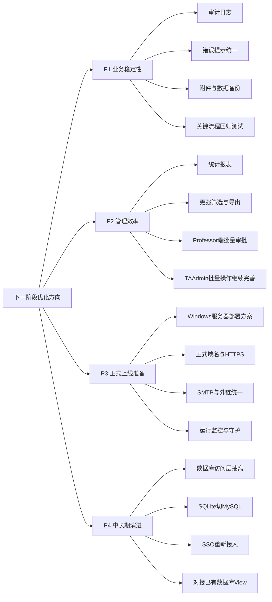

# TA系统功能梳理与下一阶段建议

## 1. 当前系统功能总览图

```mermaid
flowchart TB
  A["TA选课系统"] --> B["登录与基础"]
  A --> C["TA端"]
  A --> D["TAAdmin端"]
  A --> E["Professor端"]
  A --> F["CourseAdmin端"]
  A --> G["通知与邮件"]
  A --> H["特殊联动"]

  B --> B1["本地登录"]
  B --> B2["按角色跳转首页"]
  B --> B3["通知中心"]
  B --> B4["SAIF风格 + 手机端适配"]

  C --> C1["可申请教学班"]
  C --> C2["教学班详情与提交申请"]
  C --> C3["我的申请 / 撤销申请"]
  C --> C4["个人资料 / 简历上传"]
  C --> C5["申请规则: 开放时间、冲突、重复申请、已满关闭"]

  D --> D1["待初审申请"]
  D --> D2["全部申请"]
  D --> D3["全部教学班"]
  D --> D4["按教学班批量审批"]
  D --> D5["发布至教授 / 邮件预览 / 发送邮件"]
  D --> D6["TA管理"]

  E --> E1["待教授审批首页"]
  E --> E2["按教学班聚合审核"]
  E --> E3["单条教授审批"]
  E --> E4["达到名额上限自动拒绝其他申请"]

  F --> F1["全部申请 / 管理员改状态"]
  F --> F2["教学班管理"]
  F --> F3["教学班Excel导入"]
  F --> F4["人员管理"]
  F --> F5["人员Excel导入"]

  G --> G1["站内通知"]
  G --> G2["邮件通知"]
  G --> G3["TA提交 -> TAAdmin"]
  G --> G4["TAAdmin审批 -> TA"]
  G --> G5["Professor审批 -> TA"]
  G --> G6["发布至教授 -> Professor + CC TAAdmin"]

  H --> H1["多教授教学班"]
  H --> H2["一门课多条排课"]
  H --> H3["发布至教授后才进入Professor端"]
  H --> H4["课程满额自动关闭申请"]
  H --> H5["删除教学班级联删除"]
  H --> H6["最新简历联动到全部申请"]
```

## 1.1 当前系统功能分层表

| 模块 | 当前已实现内容 |
|---|---|
| 登录与基础 | 本地登录、按角色跳转、顶部导航、通知中心、SAIF风格、桌面端/手机端适配 |
| TA端 | 可申请教学班、查看详情、查看冲突、提交申请、我的申请、撤销申请、个人资料、个人简历上传 |
| TAAdmin端 | 待初审申请、全部申请、全部教学班、按教学班批量审批、发布至教授、邮件预览与发送、TA管理 |
| Professor端 | 待教授审批首页、按教学班审核、单条审批、达到名额上限后自动拒绝其他申请 |
| CourseAdmin端 | 全部申请、教学班管理、教学班导入、人员管理、人员导入、管理员改状态 |
| 通知与邮件 | 站内通知、邮件通知、Professor发布邮件、TA申请和审批结果邮件 |
| 特殊联动 | 多教授、多排课、发布至教授后才进入Professor、满额自动关闭申请、删除级联、最新简历联动 |

## 2. 当前系统结构判断

### 2.1 已经比较完整的部分

- 主业务链条已经完整：`TA申请 -> TAAdmin初审 -> 发布至Professor -> Professor终审`
- 管理后台能力较完整：教学班、人员、导入、批量操作、状态修正
- 通知链路较完整：站内通知 + 邮件通知
- UI 已支持桌面端和手机端

### 2.2 当前系统最有价值的下一步，不是重复加页面，而是“系统化收口”

当前更值得投入的，不是继续零散加小功能，而是围绕下面几类做升级：

- 权限与审计
- 报表与运营视图
- 部署与稳定性
- 数据层抽离，为未来切 MySQL 做准备

## 3. 下一阶段功能优先级建议

## 4. 我建议的实际排期顺序

### P1：先做，最值得

#### 1. 审计与日志

- 增加更完整的操作日志
  - 谁审批了什么
  - 谁改了申请状态
  - 谁删除了教学班
- 目标：
  - 后面正式上线后更容易追责和排查

#### 2. 报表视图

- 给 `CourseAdmin` / `TAAdmin` 增加简单统计：
  - 每门课申请数
  - 每位教授待审核数
  - TA通过率
  - 已满课程数
- 目标：
  - 让系统从“能操作”升级到“能管理”

#### 3. 部署准备

- 输出 Windows 服务器部署手册
- 统一 `.env.local` 配置说明
- 确认备份策略
- 目标：
  - 让系统具备正式上线条件

### P2：然后做，提升体验

#### 4. Professor端批量审批

- 现在 Professor 端是按教学班看申请，再逐条审批
- 后续可以加：
  - 教学班内多选通过/拒绝
  - 批量填写备注

#### 5. 导出能力

- 申请列表导出 Excel
- 教学班申请结果导出 Excel
- 人员列表导出 Excel

#### 6. 通知中心增强

- 支持已读/未读筛选
- 支持按类型筛选
- 支持批量已读

### P3：最后做，属于系统升级

#### 7. 数据层抽离

- 将当前 [server.js](/Users/yanren/Documents/Playground/server.js) 中的数据库访问逻辑逐步拆到独立模块
- 目标：
  - 为未来切 MySQL 做准备

#### 8. 切 MySQL

- 不建议现在立刻切
- 更建议等：
  - 功能基本稳定
  - 确认服务器部署方案
  - 再做数据库切换

#### 9. SSO 重接

- 当前建议保留独立示例，不在主系统强行挂接
- 等 SSO 白名单、回调地址、域名/HTTPS 条件稳定后再接回主系统

## 5. 一句话建议

如果只看“下一步最值钱的事”，我建议优先顺序是：

1. 补审计与日志  
2. 补管理统计报表  
3. 做部署手册与正式上线准备  
4. 再考虑 MySQL 和 SSO 回接
